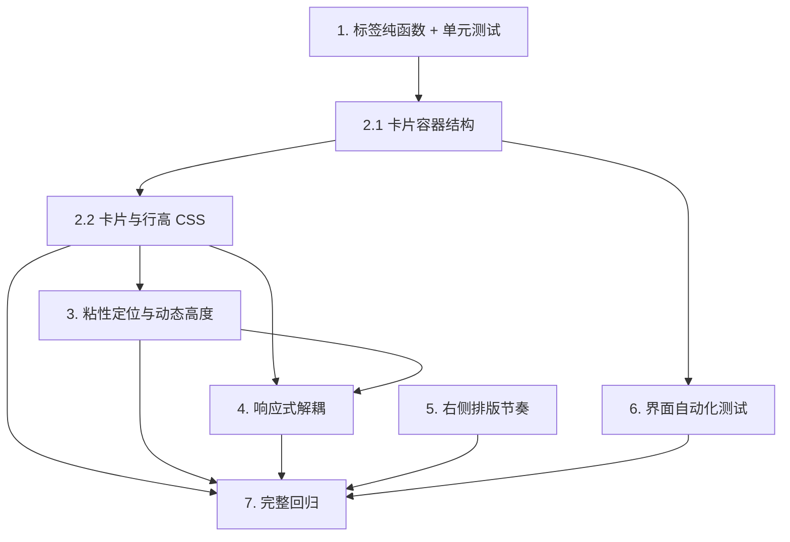

# Implementation Plan

## Overview

本计划将协调员视图的队列看板与右侧排版改造拆为 7 组任务，改动范围限定在 `src/ui/coordinator_view.py` 与 `src/ui/design.py`，外加新增测试。

顺序安排遵循两条原则：先做可独立测试的纯函数，再做会影响 DOM 的结构改动；结构改动与其配套 CSS 紧邻完成，避免中间状态下旧样式与新结构错配。任务 5（右侧节奏）与队列改造互不依赖，可并行。

不涉及数据库、服务层、Agent、工具与恢复计划逻辑。

## Task Dependency Graph



```json
{
  "waves": [
    { "wave": 1, "tasks": ["1", "5"] },
    { "wave": 2, "tasks": ["2.1"] },
    { "wave": 3, "tasks": ["2.2"] },
    { "wave": 4, "tasks": ["3", "6"] },
    { "wave": 5, "tasks": ["4"] },
    { "wave": 6, "tasks": ["7"] }
  ]
}
```

## Tasks

- [x] 1. 实现队列标签组装的纯函数与单元测试
  - 在 `src/ui/coordinator_view.py` 新增模块级常量 `QUEUE_EXCERPT_CHARS` 与纯函数 `queue_excerpt(message)`、`queue_label(row)`
  - `queue_excerpt` 先调用 `src/services/customer_response.py` 的 `customer_text()` 格式化 ISO 时间戳，再按字符数截断并追加省略号
  - `queue_excerpt` 对 `None` 或空字符串返回固定占位文案，不抛异常
  - `queue_excerpt` 转义或剥离 `*`、`_`、`` ` `` 等 Markdown 强调字符，避免 `st.button` 标签被误渲染
  - `queue_label` 按「住户姓名优先、缺失回退工单号」与「服务类型优先、未定回退原始描述摘要」组装
  - 新建 `tests/test_coordinator_queue_label.py`，覆盖姓名回退、服务类型回退、ISO 格式化、截断不破坏时间戳、空值占位、Markdown 字符不被解释
  - _Requirements: 4.1, 4.2, 4.3, 4.4, 4.5_

- [x] 2. 将队列条目重构为单一卡片容器

- [x] 2.1 改造队列渲染循环的结构
  - 在 `src/ui/coordinator_view.py` 的队列循环中，为每个工单包一层 `st.container(key=...)`
  - key 采用 `ticket-card-{request_id}`，选中项采用 `ticket-card-sel-{request_id}`，保证前者字符串被后者包含
  - 按钮标签改用 `queue_label(row)`，移除 `type='primary'` 的选中表达（选中态交由卡片承担）
  - 元信息 HTML 包一层 `dispatch-meta` 类，pill 与文本继续经 `text()` 转义
  - 区域与单元均缺失时显示明确占位文案
  - _Requirements: 2.1, 2.5, 4.6, 4.7_

- [x] 2.2 实现卡片与行高的 CSS
  - 在 `src/ui/design.py` 新增 `[class*="st-key-ticket-card-"]` 基础卡片样式（边框、圆角、内边距、背景、统一 `min-height`、纵向 flex）
  - 将卡片内 `.stButton button` 改为无边框透明、左对齐，使其融入卡片
  - 对按钮内文本段落应用两行 `-webkit-line-clamp` 截断
  - 新增 `[class*="st-key-ticket-card-sel-"]` 选中态：主色边框加粗左边框，提供颜色之外的线索
  - 新增 `.dispatch-meta` 单行省略号截断
  - 补充与项目既有按钮一致的悬停反馈
  - _Requirements: 2.2, 2.3, 2.4, 3.1, 3.2, 3.3_

- [x] 3. 实现主从布局的粘性定位与动态高度
  - 移除 `src/ui/coordinator_view.py` 中 `st.container(height=620, ...)` 的 `height` 参数，保留 `key='dispatch-queue'`
  - 在 `src/ui/design.py` 的 `:root` 新增 `--queue-top` 变量
  - 对左列内层 vertical block 应用 `position:sticky`、`top:var(--queue-top)`、`max-height:calc(100vh - ...)`、纵向 flex 与 `min-height:0`
  - 对 `.st-key-dispatch-queue` 应用 `flex:1 1 auto`、`min-height:0`、`overflow-y:auto`，使筛选控件常驻、仅列表内部滚动
  - 使用 `max-height` 而非 `height`，使条目较少时容器按内容收缩
  - _Requirements: 1.1, 1.2, 1.3, 1.4_

- [x] 4. 更新响应式规则并解除结构耦合
  - 删除 `src/ui/design.py` 中依赖固定子块高度的 `grid-template-rows:70px 40px` 规则
  - 改为列表容器横向 flex 滑动、卡片 `flex:0 0 240px` 的实现，不依赖子块数量与高度
  - 在移动断点下将左列的 `position` 降级为 `static` 并解除 `max-height`
  - 确认全局 `prefers-reduced-motion` 规则覆盖新增卡片过渡
  - _Requirements: 6.1, 6.2, 6.3, 6.4_

- [x] 5. 统一右侧详情区的排版节奏
  - 在 `src/ui/design.py` 新增阶段间距变量并应用于 `.dispatch-stage`，使相邻阶段间距一致
  - 为 `.dispatch-fields` 补齐与 `.dispatch-request`、`.dispatch-stamp` 一致的外边距
  - 清零两列首个元素的上边距，使左右两列顶部对齐
  - 为 `.dispatch-log` 增加横向滚动，与既有 `.dispatch-scroll` 行为一致
  - _Requirements: 5.1, 5.2, 5.3, 5.4_

- [x] 6. 扩展协调员界面的自动化测试
  - 新建或扩展 AppTest 用例：断言渲染的卡片数量等于筛选后可见工单数
  - 断言点击某张卡片后 `dispatch_request` 更新且右侧详情切换到该工单
  - 断言搜索框与 Show 筛选行为与改动前一致
  - 断言筛选无结果时显示无匹配提示
  - 断言选中工单后右侧六个阶段照常渲染
  - _Requirements: 2.5, 7.1, 7.2, 7.3, 7.4_

- [x] 7. 运行完整回归并确认无行为变更
  - 运行既有 `tests/test_coordinator_recovery_ui.py`，确认恢复计划区与审批、拒绝、重算动作行为不变
  - 运行完整测试套件，确认全部通过且未为通过测试而修改产品行为
  - 若实测发现 `position:sticky` 因祖先 `overflow` 失效，按设计文档的回退方案保留 `max-height` 与内部滚动，并在代码注释中记录原因
  - _Requirements: 7.5, 7.6_

## Notes

- 任务 1.5（键盘焦点自动滚入可见区域）由浏览器对 `overflow-y:auto` 容器的原生行为满足，无需额外代码；若实测不生效，再单独处理。
- 粘性定位、卡片外观、行高一致性与响应式表现无法通过 AppTest 断言（AppTest 不渲染 CSS），需按设计文档「无法自动断言的部分」所列的人工验证清单在浏览器中确认。
- 回归门槛：既有 147 项自动化测试必须全部通过。
- 本次不改动任何数据库、服务层、Agent、工具与恢复计划逻辑。
