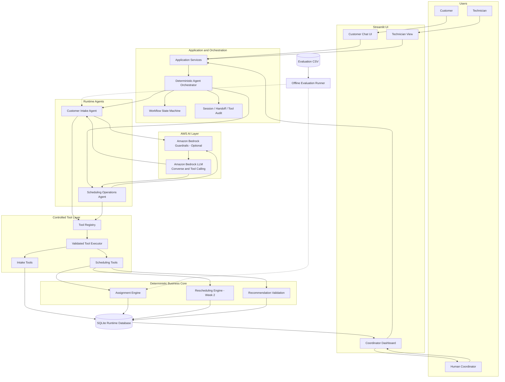
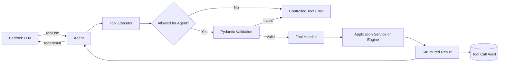
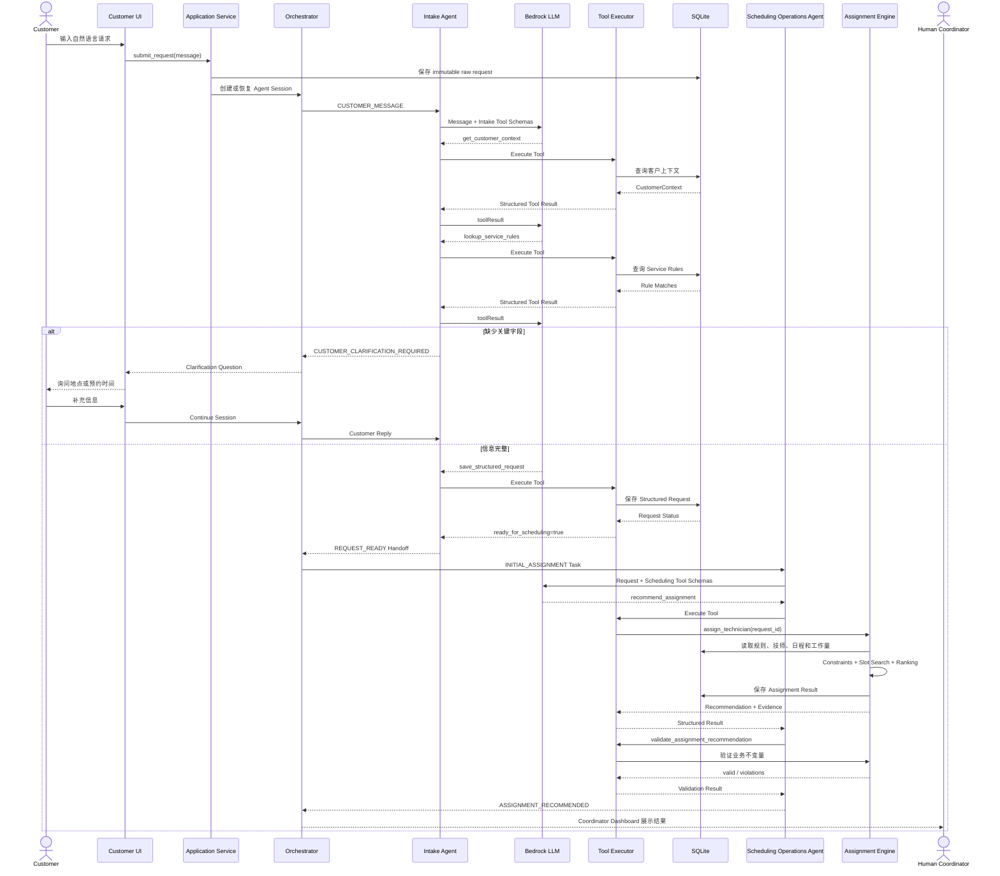
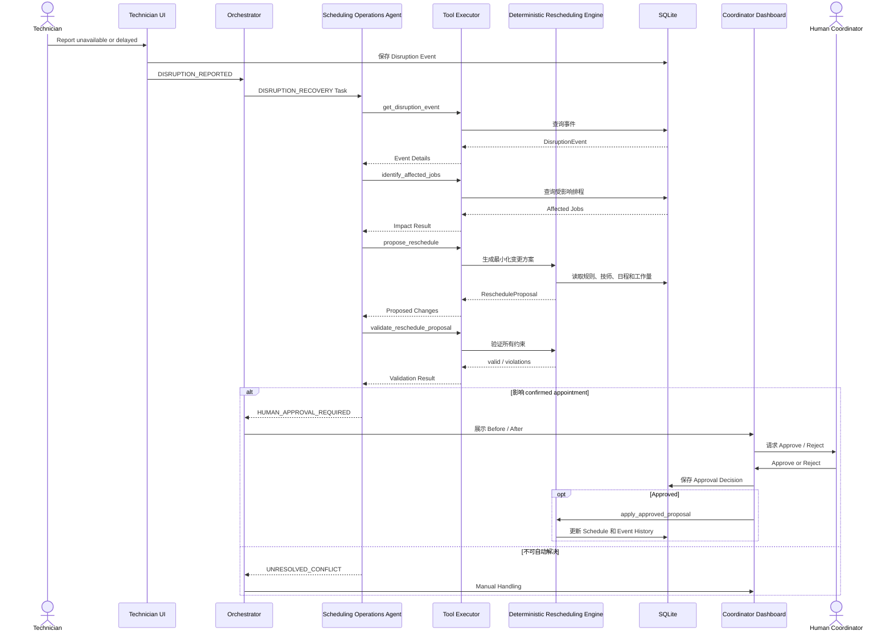
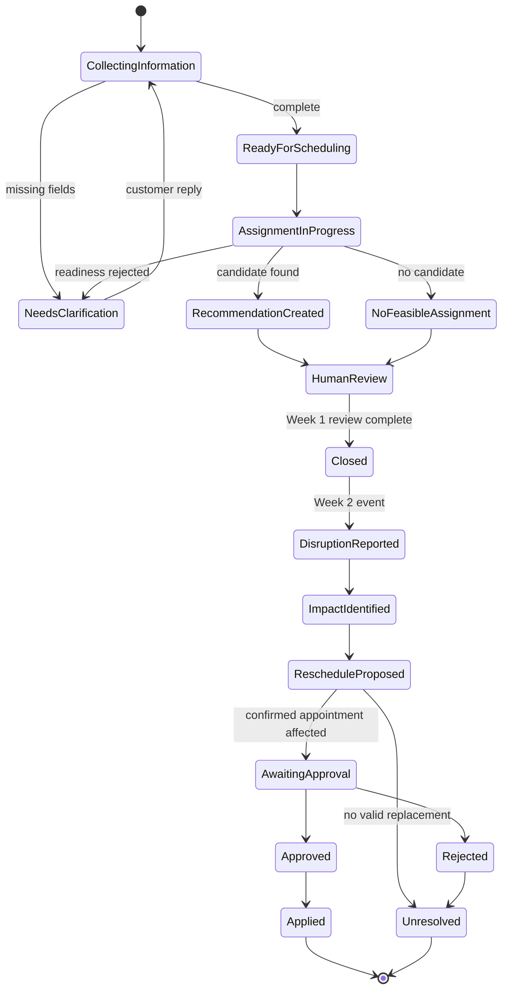

# Technician Scheduling Multi-Agent Architecture

## 1. 文档目的

本文档描述 Technician Scheduling Agent 基于当前项目实现的下一阶段架构方案，重点说明：

- Multi-Agent 的角色与职责边界
- Agent 可以调用的 Tools
- LLM、AWS、SQLite、UI 和 Human-in-the-loop 的交互逻辑
- 确定性排程引擎与 LLM 的边界
- Week 1 到 Week 2 的演进方式
- 当前代码结构的建议修改方案

本文档是设计说明，不表示所述改造已经全部实现。

---

## 2. 核心设计原则

系统遵循以下原则：

> LLM 负责理解自然语言、管理对话、选择工具和解释结果；确定性 Python 引擎负责派单与重排计算；人工保留对关键业务变更的控制权。

具体约束：

1. LLM 不直接选择技师。
2. LLM 不直接计算工作量、冲突或可行时间。
3. LLM 不直接执行 SQL。
4. Agent 只能调用 Tool Registry 中注册的工具。
5. 所有 Tool 输入都必须经过 Pydantic 校验。
6. `service_rule_id` 是服务类型的 canonical identifier。
7. 技能、证书和默认服务时长必须从 `service_rules` 获取。
8. 初次派单和异常重排必须调用确定性引擎。
9. Assignment recommendation 不得直接覆盖当前 `schedules`。
10. 影响已确认预约的变更必须经过 Human Coordinator 审批。
11. Agent Handoff 和 Tool Call 必须结构化并可审计。
12. Runtime 代码不得读取 Evaluation Ground Truth。

---

## 3. Multi-Agent 拆分共识

### 3.1 Week 1 Runtime Agents

Week 1 使用两个 Agent：

1. **Customer Intake Agent**
2. **Scheduling Operations Agent**

Coordinator 在 Week 1 中是 Human-in-the-loop 角色，通过 Coordinator Dashboard 查看推荐和异常结果，暂时不实现为独立 Agent。

### 3.2 Week 2 演进

Week 2 不单独创建 Rescheduling Agent，而是在 Scheduling Operations Agent 中增加 `DISRUPTION_RECOVERY` 工作模式。

```text
Scheduling Operations Agent
├── INITIAL_ASSIGNMENT
└── DISRUPTION_RECOVERY
```

初次派单和异常重排共用相同的领域信息与约束：

- Service rules
- Technician skills
- Certifications
- Technician status
- Shift
- Existing schedules
- Customer time window
- Workload capacity
- Feasible slot search

因此当前阶段合并在一个 Scheduling Operations Agent 中更合理，可以避免重复的 Prompt、Tools、上下文和错误处理。

### 3.3 Future Optional Agent

未来只有在 Coordinator 工作复杂度明显增加时，才考虑增加：

```text
Coordinator Copilot Agent
```

适合拆分的条件包括：

- 同时需要比较多个重排方案
- 需要汇总多个受影响客户和订单
- 需要根据运营政策判断审批优先级
- 需要生成复杂的运营影响摘要
- 需要为 Human Coordinator 准备决策材料
- 需要起草客户通知

即使增加 Coordinator Agent，最终 Approve/Reject 权限仍属于 Human Coordinator。

---

## 4. 整体架构



### 架构说明

- Streamlit 是用户与系统交互的 UI。
- Application Services 保存原始请求并提供应用层接口。
- Deterministic Orchestrator 根据业务状态路由 Agent，不使用 LLM 进行随机路由。
- 两个 Agent 可以使用同一个 Bedrock Model，但拥有不同的 System Prompt 和 Tool Allowlist。
- Tool Registry 决定哪些业务操作可以被 Agent 调用。
- Tool Executor 验证参数、执行白名单工具并记录调用日志。
- Scheduling Engine 负责确定性计算，Agent 只能使用计算结果。
- SQLite 保存运行时业务数据和 Agent Audit 数据。
- Evaluation CSV 只由 `evaluation/` 中的脚本读取。
- Human Coordinator 负责查看结果，并在 Week 2 对关键重排进行 Approve/Reject。

---

## 5. Customer Intake Agent

### 5.1 目标

将客户自然语言请求转换为完整、规范、可排程的 `StructuredRequest`。

### 5.2 职责

- 接收客户自然语言消息
- 理解服务意图
- 查询已有客户上下文
- 将客户描述映射到标准 Service Rule
- 提取地点、紧急程度和预约窗口
- 检测缺失或模糊字段
- 主动向客户追问
- 创建或更新 Structured Request
- 请求完整后 Handoff 给 Scheduling Operations Agent

### 5.3 不负责

- 选择技师
- 检查技师冲突
- 计算技师工作量
- 搜索可行 Slot
- 排序候选技师
- 修改 Schedule

### 5.4 Tools

#### `get_customer_context`

```python
get_customer_context(customer_id: str) -> CustomerContext
```

返回已有客户的区域、客户类型和历史偏好。

当前请求明确提供的信息优先于历史偏好。

#### `lookup_service_rules`

```python
lookup_service_rules(query: str) -> ServiceRuleMatches
```

根据客户描述查询候选 Service Rules。返回 canonical `service_rule_id`、category 和 subtype。

如果存在多个合理候选，Agent 应向客户澄清，不应随意选择。

#### `save_structured_request`

```python
save_structured_request(
    request_id: str,
    customer_id: str | None,
    service_rule_id: str | None,
    zone: str | None,
    urgency: str,
    window_start: str | None,
    window_end: str | None,
) -> StructuredRequest
```

服务端必须：

- 验证 `service_rule_id`
- 根据 Service Rule 派生 category 和 subtype
- 从 Service Rule 获取默认服务时长
- 计算 `missing_fields`
- 计算 `ready_for_scheduling`
- 验证预约窗口格式

LLM 不得传入或覆盖 required skills、certifications 和默认服务时长。

#### `get_request_status`

```python
get_request_status(request_id: str) -> RequestStatus
```

返回请求当前的 Structured Request、missing fields 和 readiness。

### 5.5 Handoff 输出

信息完整：

```json
{
  "handoff_type": "REQUEST_READY",
  "source_agent": "customer_intake_agent",
  "target_agent": "scheduling_operations_agent",
  "request_id": "R001"
}
```

信息不完整：

```json
{
  "handoff_type": "CUSTOMER_CLARIFICATION_REQUIRED",
  "source_agent": "customer_intake_agent",
  "target_agent": "customer",
  "request_id": "R001",
  "payload": {
    "missing_fields": ["window_start", "window_end"],
    "clarification_question": "What time would you be available?"
  }
}
```

---

## 6. Scheduling Operations Agent

### 6.1 目标

为新的客户请求生成有效、可解释、可审计的派单建议，并在已有排程受到异常影响时生成安全的修复方案。

### 6.2 工作模式

```python
class SchedulingTaskType(str, Enum):
    INITIAL_ASSIGNMENT = "INITIAL_ASSIGNMENT"
    DISRUPTION_RECOVERY = "DISRUPTION_RECOVERY"
```

Week 1 只实现 `INITIAL_ASSIGNMENT`。

Week 2 增加 `DISRUPTION_RECOVERY`。

### 6.3 Week 1 职责

- 接收 `REQUEST_READY` Handoff
- 再次验证 Request readiness
- 调用确定性 Assignment Engine
- 获取候选技师和排除原因
- 验证推荐是否满足业务约束
- 获取 Decision Trace
- 生成面向 Human Coordinator 的解释
- 无可行技师时升级人工处理

### 6.4 Week 2 增加的职责

- 接收 technician unavailable/delayed 事件
- 创建标准化 `DisruptionEvent`
- 识别受影响订单
- 调用确定性 Rescheduling Engine
- 生成 `RescheduleProposal`
- 验证 Proposal
- 判断是否影响 confirmed appointment
- 创建 Human Approval Request
- 解释 Before/After 变化
- 记录事件历史

### 6.5 不负责

- 自行选择或替换技师
- 绕过 Scheduling Engine
- 修改确定性排名规则
- 自行移动已有订单
- 自动批准重排方案
- 未经批准修改 confirmed appointment

### 6.6 Week 1 Tools

#### `get_request_status`

开始排程前重新检查 readiness。请求不完整时返回 Intake Agent。

#### `recommend_assignment`

```python
recommend_assignment(request_id: str) -> AssignmentRecommendation
```

该 Tool 调用完整的确定性 Assignment Engine，统一执行：

```text
Readiness Gate
→ Service Rule Lookup
→ Skill Filtering
→ Certification Filtering
→ Technician Status Filtering
→ Shift Validation
→ Customer Window Validation
→ Existing Schedule Conflict Check
→ Dynamic Workload Calculation
→ Workload Capacity Check
→ 30-minute Slot Search
→ Deterministic Ranking
```

排序顺序固定为：

```text
projected workload ratio
→ earliest feasible start
→ technician ID
```

该 Tool 保存 `assignment_results`，但不得修改 `schedules`。

#### `validate_assignment_recommendation`

```python
validate_assignment_recommendation(
    assignment_id: str,
) -> AssignmentValidation
```

验证：

- Request ready
- Service Rule 存在
- 技能匹配
- 证书匹配
- Technician status 为 AVAILABLE
- 推荐时间在客户窗口内
- 推荐时间在 Technician Shift 内
- 不存在 Schedule Conflict
- Projected workload 不超过上限
- 推荐结果与确定性排名一致

#### `get_assignment_decision_trace`

```python
get_assignment_decision_trace(
    assignment_id: str,
) -> AssignmentDecisionTrace
```

返回选中技师、候选技师、排除原因、工作量和排名依据。

### 6.7 Week 2 新增 Tools

```python
record_disruption_event(...)
get_disruption_event(event_id)
identify_affected_jobs(event_id)
propose_reschedule(event_id)
validate_reschedule_proposal(proposal_id)
submit_for_human_approval(proposal_id)
```

Approve、Reject 和 Apply 不建议作为 LLM Tool。它们应由 Coordinator UI 和受控 Application Service 执行：

```python
approve_proposal(proposal_id, coordinator_id)
reject_proposal(proposal_id, coordinator_id, reason)
apply_approved_proposal(proposal_id)
```

---

## 7. Tool Layer

### 7.1 为什么需要 Tool Registry

Agent 不应根据模型返回的任意函数名动态执行 Python。

Tool Registry 负责：

- 注册允许调用的工具
- 提供 Bedrock Tool Schema
- 绑定 Pydantic Input/Output Model
- 定义工具处理函数
- 定义 Agent Allowlist
- 标记工具是 Read-only 还是 Write
- 定义允许调用的 Workflow State

示意：

```python
TOOLS = {
    "get_customer_context": ToolDefinition(...),
    "lookup_service_rules": ToolDefinition(...),
    "save_structured_request": ToolDefinition(...),
    "get_request_status": ToolDefinition(...),
    "recommend_assignment": ToolDefinition(...),
    "validate_assignment_recommendation": ToolDefinition(...),
    "get_assignment_decision_trace": ToolDefinition(...),
}
```

### 7.2 Agent Tool Allowlist

| Tool | Intake Agent | Scheduling Operations Agent |
|---|---:|---:|
| `get_customer_context` | Yes | No |
| `lookup_service_rules` | Yes | No |
| `save_structured_request` | Yes | No |
| `get_request_status` | Yes | Yes |
| `recommend_assignment` | No | Yes |
| `validate_assignment_recommendation` | No | Yes |
| `get_assignment_decision_trace` | No | Yes |

### 7.3 Tool Executor

Tool Executor 是 LLM 与业务代码之间的安全边界。



Tool Executor 负责：

- 检查 Tool 是否存在
- 检查调用 Agent 是否有权限
- 校验参数
- 规范化异常
- 限制执行时间
- 记录输入、输出、状态和耗时
- 返回结构化 Tool Result

---

## 8. Agent Orchestrator 与 Handoff

### 8.1 为什么不用 Supervisor LLM

当前业务路由是明确的：

```text
Customer message → Intake Agent
REQUEST_READY → Scheduling Operations Agent
Disruption event → Scheduling Operations Agent
Human review required → Coordinator Dashboard
```

不需要额外的 Supervisor Agent 使用 LLM 猜测路由。

确定性 Orchestrator 的优势：

- 路由可预测
- 容易测试
- 成本和延迟更低
- 不会产生循环 Handoff
- 更容易执行权限和状态约束

### 8.2 Agent Handoff Schema

```python
class AgentHandoff(BaseModel):
    handoff_id: str
    session_id: str
    source_agent: str
    target_agent: str
    handoff_type: str
    request_id: str | None = None
    assignment_id: str | None = None
    event_id: str | None = None
    proposal_id: str | None = None
    payload: dict
    evidence: dict
    created_at: datetime
```

### 8.3 Week 1 Handoff Types

```text
CUSTOMER_CLARIFICATION_REQUIRED
REQUEST_READY
ASSIGNMENT_RECOMMENDED
NO_FEASIBLE_ASSIGNMENT
HUMAN_REVIEW_REQUIRED
```

### 8.4 Week 2 Handoff Types

```text
DISRUPTION_REPORTED
IMPACT_IDENTIFIED
RESCHEDULE_PROPOSED
HUMAN_APPROVAL_REQUIRED
PROPOSAL_APPROVED
PROPOSAL_REJECTED
UNRESOLVED_CONFLICT
```

---

## 9. Week 1 完整流程



---

## 10. Week 2 异常重排流程



---

## 11. Workflow State

### 11.1 Week 1 States

```text
COLLECTING_INFORMATION
NEEDS_CLARIFICATION
READY_FOR_SCHEDULING
ASSIGNMENT_IN_PROGRESS
RECOMMENDATION_CREATED
HUMAN_REVIEW_REQUIRED
NO_FEASIBLE_ASSIGNMENT
CLOSED
ERROR
```

### 11.2 Week 2 States

```text
DISRUPTION_REPORTED
IMPACT_ANALYSIS_IN_PROGRESS
IMPACT_IDENTIFIED
RESCHEDULE_IN_PROGRESS
RESCHEDULE_PROPOSED
AWAITING_HUMAN_APPROVAL
APPROVED
REJECTED
APPLIED
UNRESOLVED
```



---

## 12. Database 交互设计

### 12.1 当前 Runtime Tables

```text
company_profile
service_rules
technicians
customers
jobs
schedules
customer_requests
structured_requests
assignment_results
```

### 12.2 建议新增的 Agent Tables

#### `agent_sessions`

```text
session_id
request_id
customer_id
current_agent
workflow_status
created_at
updated_at
```

用途：保存多轮对话和 Agent Workflow 的业务状态。

#### `agent_handoffs`

```text
handoff_id
session_id
source_agent
target_agent
handoff_type
payload_json
evidence_json
created_at
```

用途：记录 Agent 之间的结构化交接。

#### `agent_tool_calls`

```text
tool_call_id
session_id
agent_name
tool_name
input_json
output_json
execution_status
duration_ms
created_at
```

用途：审计 Tool Calling，并在 Coordinator Dashboard 展示 Agent Activity Timeline。

### 12.3 Week 2 建议新增 Tables

```text
technician_events
reschedule_proposals
reschedule_proposal_items
approval_decisions
event_history
```

### 12.4 数据写入权限

| 操作 | 执行方 |
|---|---|
| 保存 raw customer message | Application Service |
| 保存 structured request | Intake Tool |
| 保存 assignment recommendation | Assignment Engine |
| 修改 current schedule | 受控 Application Service / Engine |
| 保存 disruption event | Technician/Coordinator Service |
| 保存 reschedule proposal | Rescheduling Engine |
| Approve/Reject proposal | Human Coordinator UI |
| 应用 approved proposal | Deterministic Service |

---

## 13. LLM 与 AWS 交互

### 13.1 Bedrock Client

当前一次性 `extract_request()` 接口建议演进为通用 Converse Client：

```python
converse(
    messages: list,
    system_prompt: str,
    tool_config: dict,
    guardrail_config: dict | None = None,
) -> ModelResponse
```

Bedrock Client 只负责：

- 调用 Amazon Bedrock
- 传递 Messages 和 Tool Schemas
- 解析 `toolUse`
- 解析最终文本
- 返回 usage、latency 和 stop reason
- 执行有限重试
- 应用可选 Guardrails

Bedrock Client 不包含客户、服务规则或排程业务逻辑。

### 13.2 Tool Calling Loop

```text
Application sends messages + tool definitions to Bedrock
→ Model returns toolUse
→ Agent sends request to Tool Executor
→ Tool Executor validates and runs Python handler
→ Application sends toolResult back to Bedrock
→ Model requests another tool or returns final response
```

每次 Agent 执行应限制最大 Tool Turn，例如：

```text
MAX_TOOL_TURNS = 8
```

达到限制时返回受控错误，不继续无限循环。

### 13.3 Mock Fallback

本地开发和测试继续支持：

```env
INTAKE_BACKEND=mock
```

建议将 Mock 扩展为可以模拟两个 Agent 的 Tool Calling：

- Mock Intake Agent 输出固定 Tool Calls
- Mock Scheduling Agent 调用正常确定性 Scheduling Tools
- Tests 不依赖 AWS Credentials

### 13.4 Local LLM Backend

除了 Mock 和 Bedrock，开发环境支持连接本地 OpenAI-compatible API：

```env
LLM_BACKEND=local
LOCAL_LLM_BASE_URL=http://127.0.0.1:1234/v1
LOCAL_LLM_API_KEY=local
LOCAL_LLM_MODEL=your-tool-capable-model
LOCAL_LLM_TIMEOUT_SEC=60
```

本地适配器调用：

```text
POST {LOCAL_LLM_BASE_URL}/chat/completions
```

它负责在 OpenAI-compatible `tool_calls` 格式与项目内部使用的 Bedrock `toolUse/toolResult` 格式之间转换。因此 Agent、Tool Registry、Tool Executor 和 Orchestrator 不需要针对本地模型增加另一套业务逻辑。

本地模型必须支持 function/tool calling。若模型只支持普通文本生成，应继续使用 Mock backend 调试确定性业务流程。

### 13.5 Guardrails

Guardrails 是可选的后期增强项，可用于：

- Prompt injection 检测
- 不相关主题限制
- 敏感客户信息掩码
- 限制不安全或未经工具验证的输出

Guardrails 不代替：

- Pydantic Validation
- Tool Allowlist
- Business Rules
- Human Approval

---

## 14. Human-in-the-loop

### 14.1 Week 1

Week 1 的 Human Coordinator：

- 查看客户原始请求
- 查看 AI 提取字段
- 查看 Agent Handoff Timeline
- 查看 Tool Call Timeline
- 查看推荐技师和预约时间
- 查看候选技师排除原因
- 处理 `NO_FEASIBLE_ASSIGNMENT`

Week 1 的 recommendation 不自动覆盖 `schedules`。

### 14.2 Week 2

以下情况必须请求人工审批：

- 修改 confirmed appointment
- 改变预约时间
- 改变已确认的 Technician
- 影响多个订单
- Proposal 验证失败
- 没有可行替代方案

权限边界：

```text
Agent can propose
Human can approve or reject
System can apply only an approved proposal
```

---

## 15. UI 修改思路

### 15.1 Customer View

当前表单建议演进为多轮 Chat：

- 显示客户和 Intake Agent 的消息
- 显示 clarification question
- 保持同一个 Agent Session
- 显示 Structured Request Preview
- 显示最终 recommendation

不向客户显示模型隐藏推理过程。

### 15.2 Coordinator View

建议增加：

- Raw Customer Request
- AI Extracted Fields
- Current Workflow State
- Agent Handoff Timeline
- Tool Call Timeline
- Candidate Elimination Table
- Recommended Technician
- Recommended Appointment Time
- Workload Before/After
- Ranking Reason
- Human Review Status

示例 Timeline：

```text
10:01:02  Intake Agent called get_customer_context
10:01:03  Intake Agent called lookup_service_rules
10:01:04  Intake Agent → Scheduling Operations Agent: REQUEST_READY
10:01:05  Scheduling Operations Agent called recommend_assignment
10:01:06  Scheduling Operations Agent called validate_assignment_recommendation
10:01:07  Scheduling Operations Agent → Human: ASSIGNMENT_RECOMMENDED
```

### 15.3 Technician View

Week 1 保持简单：

- Technician
- Assigned jobs
- Start/end time
- Service type
- Customer zone

Week 2 增加：

- AVAILABLE / UNAVAILABLE
- DELAYED
- COMPLETED
- Report disruption

---

## 16. 当前项目状态

当前已经实现：

- SQLite Schema
- Runtime Seed Data
- 9 Service Rules
- 8 Technicians
- 12 Customers
- 16 Existing Jobs and Schedules
- 10 Customer Requests
- Structured Request Schema
- Mock Intake
- Bedrock Adapter
- Request Readiness Gate
- Skill/Certification/Status Filtering
- Shift and Conflict Validation
- Dynamic Workload Calculation
- 30-minute Slot Search
- Deterministic Ranking
- Assignment Result Persistence
- Evaluation CSV Isolation
- Basic Streamlit Views
- Unit Tests and Seed Validation

当前尚未实现：

- Bedrock Converse Tool Calling
- 两个独立 Runtime Agent
- Tool Registry
- Tool Executor
- Agent Tool Allowlist
- Multi-turn Agent Sessions
- Structured Agent Handoff
- Workflow State Machine
- Agent Session/Handoff/Tool Audit Tables
- Assignment Recommendation 二次验证
- Coordinator Agent Timeline
- Candidate Decision Trace UI
- Week 2 Disruption and Rescheduling

---

## 17. 基于当前项目的修改方案

### 17.1 建议目标目录

```text
src/
├── agents/
│   ├── __init__.py
│   ├── base_agent.py
│   ├── intake_agent.py
│   └── scheduling_operations_agent.py
│
├── orchestration/
│   ├── __init__.py
│   ├── orchestrator.py
│   ├── state_machine.py
│   └── handoff.py
│
├── tools/
│   ├── __init__.py
│   ├── registry.py
│   ├── executor.py
│   ├── intake_tools.py
│   └── scheduling_tools.py
│
├── llm/
│   ├── __init__.py
│   ├── bedrock_client.py
│   ├── mock_client.py
│   └── response_parser.py
│
├── scheduling/
│   ├── assignment_engine.py
│   ├── eligibility.py
│   ├── conflicts.py
│   ├── workload.py
│   ├── slots.py
│   └── ranking.py
│
├── rescheduling/                 # Week 2
│   ├── __init__.py
│   ├── impact_analysis.py
│   ├── proposal_engine.py
│   └── validation.py
│
├── schemas/
│   ├── request.py
│   ├── assignment.py
│   ├── agent.py
│   ├── handoff.py
│   ├── disruption.py             # Week 2
│   └── reschedule.py             # Week 2
│
├── services/
├── ui/
├── database.py
└── config.py
```

### 17.2 现有文件迁移思路

```text
src/intake/intake_agent.py
→ src/agents/intake_agent.py

src/intake/bedrock_client.py
→ src/llm/bedrock_client.py

src/intake/mock_intake.py
→ src/llm/mock_client.py

src/intake/parser.py
→ src/llm/response_parser.py
```

现有 `src/scheduling/` 尽量保持不变，只通过 Scheduling Tool 包装：

```python
def recommend_assignment_tool(request_id: str):
    return assign_technician(request_id)
```

### 17.3 分阶段修改顺序

#### Phase 1：Schema 与 Audit

- 新增 Agent、Handoff、Tool Call Schema
- 新增 `agent_sessions`
- 新增 `agent_handoffs`
- 新增 `agent_tool_calls`
- 增加数据库迁移和验证

#### Phase 2：Tool Layer

- 把现有 Service Functions 包装成 Tools
- 实现 Tool Registry
- 实现 Agent Allowlist
- 实现 Tool Executor
- 增加 Tool Unit Tests

#### Phase 3：两个 Agent

- 实现 Customer Intake Agent
- 实现 Scheduling Operations Agent
- 为两个 Agent 配置不同 Prompt 和 Tool Allowlist
- 实现 Mock Agent Backend
- 保证 Tests 不依赖 AWS

#### Phase 4：Orchestration

- 实现 Workflow State Machine
- 实现 Agent Handoff
- 实现 Tool Turn Limit
- 实现 Error Routing
- 实现 Handoff Tests

#### Phase 5：Bedrock

- 将 Bedrock Adapter 改为 Converse Tool Calling
- 支持 `toolUse` 和 `toolResult`
- 增加 Retry、Timeout 和 Controlled Failure
- 保留 Mock Fallback

#### Phase 6：UI

- Customer 多轮 Chat
- Structured Request Preview
- Coordinator Agent Timeline
- Candidate Decision Trace
- Human Review 状态

#### Phase 7：Week 2

- 为 Scheduling Operations Agent 增加 `DISRUPTION_RECOVERY`
- 实现 Rescheduling Engine
- 实现 Proposal Validation
- 实现 Human Approval
- 实现 Event History

---

## 18. 测试与评估

### 18.1 Intake Agent

```text
Service rule mapping accuracy
Location extraction accuracy
Appointment window accuracy
Missing-field detection accuracy
Clarification success rate
Correct REQUEST_READY handoff rate
```

### 18.2 Scheduling Operations Agent

```text
Correct tool selection rate
Invalid scheduling attempt rate
Deterministic result preservation rate
Correct handoff rate
Explanation groundedness
Human escalation accuracy
```

### 18.3 Tools 和 Engine

继续验证：

- Skill matching
- Certification matching
- Technician status
- Shift constraints
- Schedule conflicts
- Workload capacity
- Feasible slot search
- Deterministic tie-break
- No feasible technician
- Recommendation does not modify schedule
- Agent cannot call unauthorized tool
- Runtime cannot access evaluation ground truth

### 18.4 Week 2

```text
Affected-job identification accuracy
Valid replacement rate
Confirmed-appointment approval compliance
Unresolved-conflict escalation rate
Schedule-change minimization
```

---

## 19. Demo Flow

建议准备三个 Week 1 Demo Case：

### Case 1：完整请求

```text
Customer Message
→ Intake Agent Tools
→ REQUEST_READY Handoff
→ Scheduling Operations Agent
→ Deterministic Assignment
→ Validated Recommendation
→ Coordinator Dashboard
```

### Case 2：缺失信息

```text
Customer Message
→ Intake Agent 检测缺少 Appointment Window
→ Customer Clarification
→ 同一个 Session 补充信息
→ REQUEST_READY
→ Assignment Recommendation
```

### Case 3：无可行技师

```text
Customer Message
→ Structured Request
→ Scheduling Engine 排除所有候选人
→ Decision Trace 显示排除原因
→ HUMAN_REVIEW_REQUIRED
```

Week 2 增加：

```text
Technician Unavailable
→ Scheduling Operations Agent
→ Identify Affected Jobs
→ Reschedule Proposal
→ Before/After
→ Human Approve/Reject
→ Apply Approved Change
```

---

## 20. 最终定位

英文：

> A multi-agent field-service scheduling system where a Customer Intake Agent structures customer needs, a Scheduling Operations Agent coordinates deterministic assignment and disruption recovery, and humans retain control over operational changes.

中文：

> 一个多 Agent 现场服务排程系统：Customer Intake Agent 负责理解并结构化客户需求，Scheduling Operations Agent 负责协调确定性派单与异常恢复，Human Coordinator 保留对关键业务变更的最终控制权。
