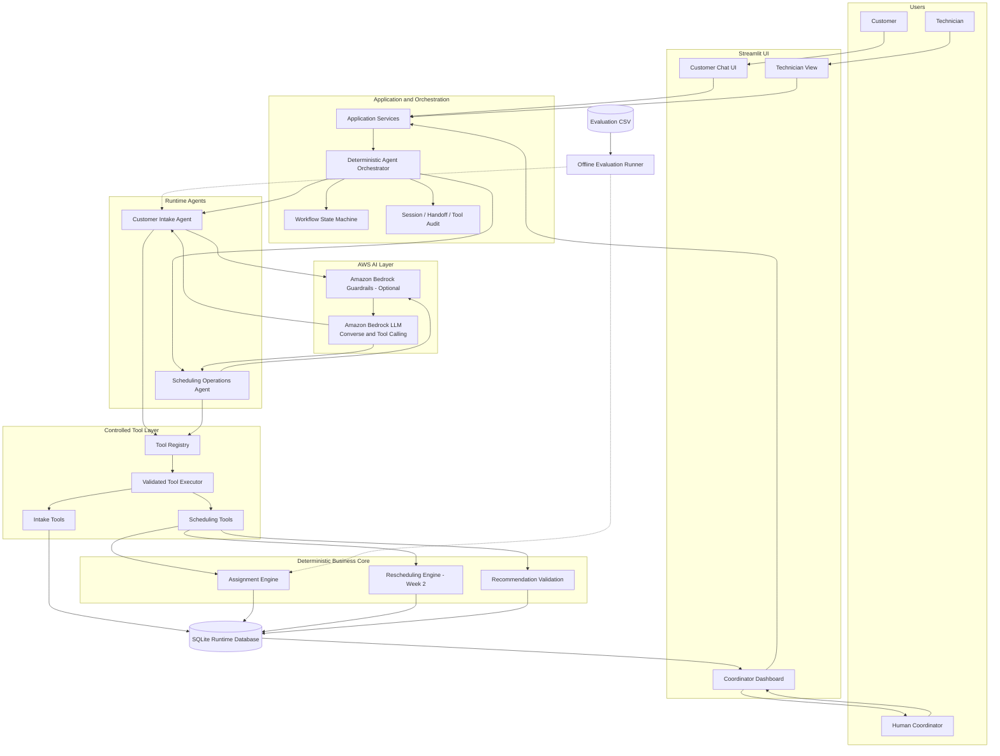
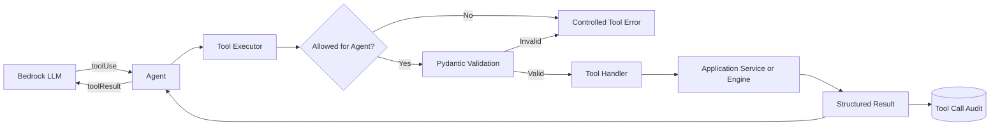
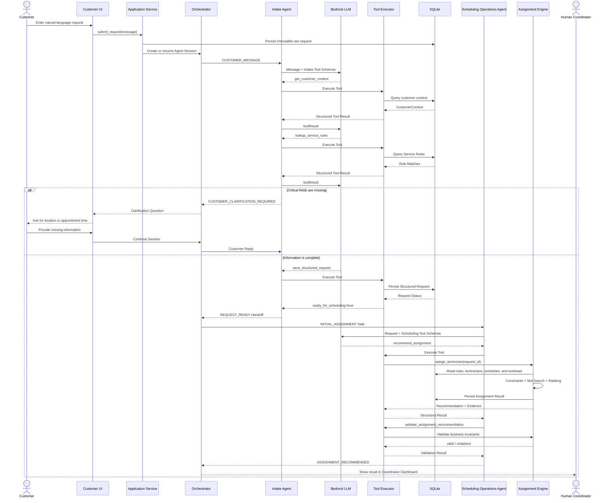
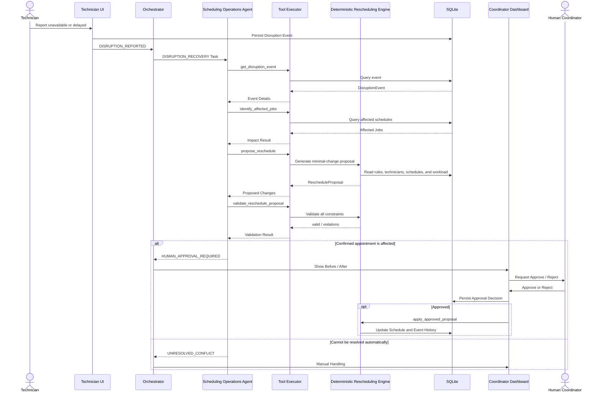
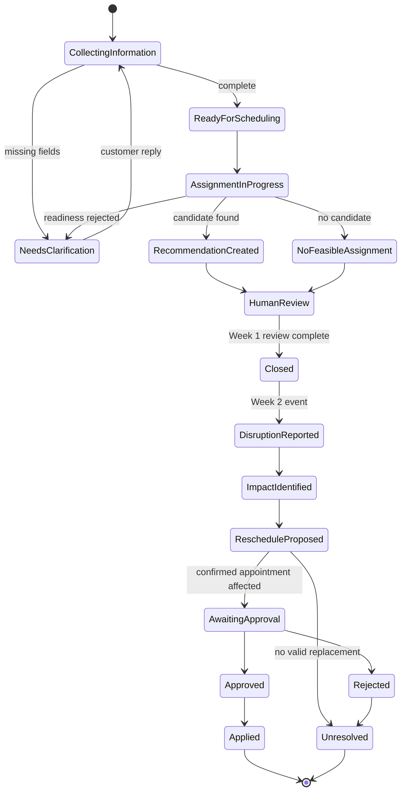

# Technician Scheduling Multi-Agent Architecture

## 1. Purpose of This Document

This document describes the next-stage architecture for the Technician Scheduling Agent based on the current project implementation, with a focus on:

- Roles and responsibility boundaries in the Multi-Agent design
- Tools that each Agent is allowed to call
- Interaction logic among the LLM, AWS, SQLite, UI, and Human-in-the-loop
- The boundary between the deterministic scheduling engine and the LLM
- The evolution path from Week 1 to Week 2
- Recommended changes to the current code structure

This is a design document and does not imply that every proposed change described below has already been implemented.

---

## 2. Core Design Principles

The system follows this principle:

> The LLM is responsible for understanding natural language, managing dialogue, selecting tools, and explaining results; deterministic Python engines are responsible for assignment and rescheduling calculations; humans retain control over critical operational changes.

Specific constraints:

1. The LLM does not directly select technicians.
2. The LLM does not directly calculate workload, conflicts, or feasible time slots.
3. The LLM does not execute SQL directly.
4. An Agent may only call tools registered in the Tool Registry.
5. All Tool inputs must be validated with Pydantic.
6. `service_rule_id` is the canonical identifier for service type.
7. Skills, certifications, and default service duration must come from `service_rules`.
8. Initial assignment and disruption recovery must call deterministic engines.
9. An assignment recommendation must not directly overwrite the current `schedules`.
10. Any change that affects a confirmed appointment must be approved by the Human Coordinator.
11. Agent Handoffs and Tool Calls must be structured and auditable.
12. Runtime code must not read Evaluation Ground Truth.

---

## 3. Multi-Agent Decomposition

### 3.1 Week 1 Runtime Agents

Week 1 uses two Agents:

1. **Customer Intake Agent**
2. **Scheduling Operations Agent**

In Week 1, the Coordinator remains a Human-in-the-loop role. The Human Coordinator reviews recommendations and exception results through the Coordinator Dashboard and is not implemented as a separate Agent.

### 3.2 Week 2 Evolution

Week 2 does not introduce a separate Rescheduling Agent. Instead, `DISRUPTION_RECOVERY` is added as a second operating mode of the Scheduling Operations Agent.

```text
Scheduling Operations Agent
├── INITIAL_ASSIGNMENT
└── DISRUPTION_RECOVERY
```

Initial assignment and disruption recovery share the same domain information and constraints:

- Service rules
- Technician skills
- Certifications
- Technician status
- Shift
- Existing schedules
- Customer time window
- Workload capacity
- Feasible slot search

For the current scope, keeping both activities in one Scheduling Operations Agent is more appropriate because it avoids duplicated prompts, tools, context, and error-handling logic.

### 3.3 Future Optional Agent

A future Agent should only be introduced if Coordinator work becomes materially more complex:

```text
Coordinator Copilot Agent
```

Possible conditions for splitting this role include:

- Comparing multiple rescheduling proposals at the same time
- Summarising multiple affected customers and jobs
- Using operational policies to prioritise approvals
- Generating complex operational impact summaries
- Preparing decision material for the Human Coordinator
- Drafting customer notifications

Even if a Coordinator Agent is added, final Approve/Reject authority remains with the Human Coordinator.

---

## 4. Overall Architecture



### Architecture Notes

- Streamlit is the UI through which users interact with the system.
- Application Services persist raw requests and provide application-layer interfaces.
- The Deterministic Orchestrator routes Agents based on business state instead of asking an LLM to decide routing probabilistically.
- Both Agents may use the same Bedrock model while having different System Prompts and Tool Allowlists.
- The Tool Registry defines which business operations an Agent is allowed to invoke.
- The Tool Executor validates parameters, executes allowlisted tools, and records call logs.
- The Scheduling Engine performs deterministic calculations; the Agent can only use the engine's results.
- SQLite stores runtime business data and Agent audit data.
- Evaluation CSV files are read only by scripts in `evaluation/`.
- The Human Coordinator reviews results and, in Week 2, Approves/Rejects critical rescheduling changes.

---

## 5. Customer Intake Agent

### 5.1 Objective

Convert a customer's natural-language request into a complete, standardised, schedulable `StructuredRequest`.

### 5.2 Responsibilities

- Receive natural-language customer messages
- Understand the service intent
- Retrieve existing customer context
- Map the customer's description to a standard Service Rule
- Extract location, urgency, and appointment window
- Detect missing or ambiguous fields
- Proactively ask the customer for clarification
- Create or update a Structured Request
- Hand off to the Scheduling Operations Agent once the request is complete

### 5.3 Out of Scope

The Customer Intake Agent does not:

- Select technicians
- Check technician schedule conflicts
- Calculate technician workload
- Search for feasible slots
- Rank technician candidates
- Modify the Schedule

### 5.4 Tools

#### `get_customer_context`

```python
get_customer_context(customer_id: str) -> CustomerContext
```

Returns the existing customer's zone, customer type, and historical preferences.

Information explicitly provided in the current request takes precedence over historical preferences.

#### `lookup_service_rules`

```python
lookup_service_rules(query: str) -> ServiceRuleMatches
```

Queries candidate Service Rules from the customer's description and returns the canonical `service_rule_id`, category, and subtype.

If more than one candidate is reasonably plausible, the Agent should clarify with the customer rather than selecting one arbitrarily.

#### `save_structured_request`

```python
save_structured_request(
    request_id: str,
    customer_id: str | None,
    service_rule_id: str | None,
    zone: str | None,
    urgency: str,
    window_start: str | None,
    window_end: str | None,
) -> StructuredRequest
```

The server must:

- Validate `service_rule_id`
- Derive category and subtype from the Service Rule
- Obtain default service duration from the Service Rule
- Calculate `missing_fields`
- Calculate `ready_for_scheduling`
- Validate the appointment-window format

The LLM must not provide or override required skills, certifications, or default service duration.

#### `get_request_status`

```python
get_request_status(request_id: str) -> RequestStatus
```

Returns the current Structured Request, missing fields, and readiness state for the request.

### 5.5 Handoff Output

When information is complete:

```json
{
  "handoff_type": "REQUEST_READY",
  "source_agent": "customer_intake_agent",
  "target_agent": "scheduling_operations_agent",
  "request_id": "R001"
}
```

When information is incomplete:

```json
{
  "handoff_type": "CUSTOMER_CLARIFICATION_REQUIRED",
  "source_agent": "customer_intake_agent",
  "target_agent": "customer",
  "request_id": "R001",
  "payload": {
    "missing_fields": ["window_start", "window_end"],
    "clarification_question": "What time would you be available?"
  }
}
```

---

## 6. Scheduling Operations Agent

### 6.1 Objective

Generate valid, explainable, and auditable assignment recommendations for new customer requests, and generate safe recovery proposals when existing schedules are affected by disruptions.

### 6.2 Operating Modes

```python
class SchedulingTaskType(str, Enum):
    INITIAL_ASSIGNMENT = "INITIAL_ASSIGNMENT"
    DISRUPTION_RECOVERY = "DISRUPTION_RECOVERY"
```

Week 1 implements only `INITIAL_ASSIGNMENT`.

Week 2 adds `DISRUPTION_RECOVERY`.

### 6.3 Week 1 Responsibilities

- Receive the `REQUEST_READY` Handoff
- Revalidate request readiness
- Invoke the deterministic Assignment Engine
- Retrieve eligible technician candidates and exclusion reasons
- Validate whether the recommendation satisfies business constraints
- Retrieve the Decision Trace
- Generate an explanation for the Human Coordinator
- Escalate to human handling when no feasible technician exists

### 6.4 Additional Week 2 Responsibilities

- Receive technician unavailable/delayed events
- Create a standardised `DisruptionEvent`
- Identify affected jobs
- Invoke the deterministic Rescheduling Engine
- Generate a `RescheduleProposal`
- Validate the Proposal
- Determine whether a confirmed appointment is affected
- Create a Human Approval Request
- Explain the Before/After changes
- Record event history

### 6.5 Out of Scope

The Scheduling Operations Agent does not:

- Select or replace technicians by itself
- Bypass the Scheduling Engine
- Modify deterministic ranking rules
- Move existing jobs by itself
- Automatically approve rescheduling proposals
- Modify confirmed appointments without approval

### 6.6 Week 1 Tools

#### `get_request_status`

Rechecks readiness before scheduling begins. If the request is incomplete, it is routed back to the Intake Agent.

#### `recommend_assignment`

```python
recommend_assignment(request_id: str) -> AssignmentRecommendation
```

This Tool invokes the complete deterministic Assignment Engine and executes:

```text
Readiness Gate
→ Service Rule Lookup
→ Skill Filtering
→ Certification Filtering
→ Technician Status Filtering
→ Shift Validation
→ Customer Window Validation
→ Existing Schedule Conflict Check
→ Dynamic Workload Calculation
→ Workload Capacity Check
→ 30-minute Slot Search
→ Deterministic Ranking
```

The ranking order is fixed:

```text
projected workload ratio
→ earliest feasible start
→ technician ID
```

The Tool persists `assignment_results` but must not modify `schedules`.

#### `validate_assignment_recommendation`

```python
validate_assignment_recommendation(
    assignment_id: str,
) -> AssignmentValidation
```

Validation checks include:

- Request is ready
- Service Rule exists
- Skill match
- Certification match
- Technician status is AVAILABLE
- Recommended time is within the customer window
- Recommended time is within the Technician Shift
- No Schedule Conflict exists
- Projected workload does not exceed the limit
- Recommendation is consistent with deterministic ranking

#### `get_assignment_decision_trace`

```python
get_assignment_decision_trace(
    assignment_id: str,
) -> AssignmentDecisionTrace
```

Returns the selected technician, candidate technicians, exclusion reasons, workload information, and ranking evidence.

### 6.7 New Week 2 Tools

```python
record_disruption_event(...)
get_disruption_event(event_id)
identify_affected_jobs(event_id)
propose_reschedule(event_id)
validate_reschedule_proposal(proposal_id)
submit_for_human_approval(proposal_id)
```

Approve, Reject, and Apply should not be exposed as LLM Tools. They should be executed by the Coordinator UI and controlled Application Services:

```python
approve_proposal(proposal_id, coordinator_id)
reject_proposal(proposal_id, coordinator_id, reason)
apply_approved_proposal(proposal_id)
```

---

## 7. Tool Layer

### 7.1 Why a Tool Registry Is Required

An Agent must not dynamically execute arbitrary Python function names returned by the model.

The Tool Registry is responsible for:

- Registering tools that are allowed to be called
- Providing Bedrock Tool Schemas
- Binding Pydantic Input/Output Models
- Defining tool handlers
- Defining Agent Allowlists
- Marking tools as Read-only or Write
- Defining the Workflow States in which a tool may be called

Illustrative example:

```python
TOOLS = {
    "get_customer_context": ToolDefinition(...),
    "lookup_service_rules": ToolDefinition(...),
    "save_structured_request": ToolDefinition(...),
    "get_request_status": ToolDefinition(...),
    "recommend_assignment": ToolDefinition(...),
    "validate_assignment_recommendation": ToolDefinition(...),
    "get_assignment_decision_trace": ToolDefinition(...),
}
```

### 7.2 Agent Tool Allowlist

| Tool | Intake Agent | Scheduling Operations Agent |
|---|---:|---:|
| `get_customer_context` | Yes | No |
| `lookup_service_rules` | Yes | No |
| `save_structured_request` | Yes | No |
| `get_request_status` | Yes | Yes |
| `recommend_assignment` | No | Yes |
| `validate_assignment_recommendation` | No | Yes |
| `get_assignment_decision_trace` | No | Yes |

### 7.3 Tool Executor

The Tool Executor is the safety boundary between the LLM and business code.



The Tool Executor is responsible for:

- Checking whether a Tool exists
- Checking whether the calling Agent is authorised
- Validating parameters
- Normalising exceptions
- Limiting execution time
- Recording input, output, status, and duration
- Returning a structured Tool Result

---

## 8. Agent Orchestrator and Handoff

### 8.1 Why Not Use a Supervisor LLM

The current business routing logic is explicit:

```text
Customer message → Intake Agent
REQUEST_READY → Scheduling Operations Agent
Disruption event → Scheduling Operations Agent
Human review required → Coordinator Dashboard
```

There is no need for an additional Supervisor Agent to ask an LLM to guess the routing decision.

Advantages of a deterministic Orchestrator:

- Predictable routing
- Easier testing
- Lower cost and latency
- No looping Handoffs
- Easier enforcement of permissions and state constraints

### 8.2 Agent Handoff Schema

```python
class AgentHandoff(BaseModel):
    handoff_id: str
    session_id: str
    source_agent: str
    target_agent: str
    handoff_type: str
    request_id: str | None = None
    assignment_id: str | None = None
    event_id: str | None = None
    proposal_id: str | None = None
    payload: dict
    evidence: dict
    created_at: datetime
```

### 8.3 Week 1 Handoff Types

```text
CUSTOMER_CLARIFICATION_REQUIRED
REQUEST_READY
ASSIGNMENT_RECOMMENDED
NO_FEASIBLE_ASSIGNMENT
HUMAN_REVIEW_REQUIRED
```

### 8.4 Week 2 Handoff Types

```text
DISRUPTION_REPORTED
IMPACT_IDENTIFIED
RESCHEDULE_PROPOSED
HUMAN_APPROVAL_REQUIRED
PROPOSAL_APPROVED
PROPOSAL_REJECTED
UNRESOLVED_CONFLICT
```

---

## 9. Complete Week 1 Flow



---

## 10. Week 2 Disruption-Rescheduling Flow



---

## 11. Workflow State

### 11.1 Week 1 States

```text
COLLECTING_INFORMATION
NEEDS_CLARIFICATION
READY_FOR_SCHEDULING
ASSIGNMENT_IN_PROGRESS
RECOMMENDATION_CREATED
HUMAN_REVIEW_REQUIRED
NO_FEASIBLE_ASSIGNMENT
CLOSED
ERROR
```

### 11.2 Week 2 States

```text
DISRUPTION_REPORTED
IMPACT_ANALYSIS_IN_PROGRESS
IMPACT_IDENTIFIED
RESCHEDULE_IN_PROGRESS
RESCHEDULE_PROPOSED
AWAITING_HUMAN_APPROVAL
APPROVED
REJECTED
APPLIED
UNRESOLVED
```



---

## 12. Database Interaction Design

### 12.1 Current Runtime Tables

```text
company_profile
service_rules
technicians
customers
jobs
schedules
customer_requests
structured_requests
assignment_results
```

### 12.2 Recommended Agent Tables

#### `agent_sessions`

```text
session_id
request_id
customer_id
current_agent
workflow_status
created_at
updated_at
```

Purpose: persist business state for multi-turn dialogue and Agent Workflow execution.

#### `agent_handoffs`

```text
handoff_id
session_id
source_agent
target_agent
handoff_type
payload_json
evidence_json
created_at
```

Purpose: record structured handoffs between Agents.

#### `agent_tool_calls`

```text
tool_call_id
session_id
agent_name
tool_name
input_json
output_json
execution_status
duration_ms
created_at
```

Purpose: audit Tool Calling and support an Agent Activity Timeline in the Coordinator Dashboard.

### 12.3 Recommended Week 2 Tables

```text
technician_events
reschedule_proposals
reschedule_proposal_items
approval_decisions
event_history
```

### 12.4 Data-Write Permissions

| Operation | Executor |
|---|---|
| Persist raw customer message | Application Service |
| Persist structured request | Intake Tool |
| Persist assignment recommendation | Assignment Engine |
| Modify current schedule | Controlled Application Service / Engine |
| Persist disruption event | Technician/Coordinator Service |
| Persist reschedule proposal | Rescheduling Engine |
| Approve/Reject proposal | Human Coordinator UI |
| Apply approved proposal | Deterministic Service |

---

## 13. LLM and AWS Interaction

### 13.1 Bedrock Client

The current one-shot `extract_request()` interface is recommended to evolve into a general Converse Client:

```python
converse(
    messages: list,
    system_prompt: str,
    tool_config: dict,
    guardrail_config: dict | None = None,
) -> ModelResponse
```

The Bedrock Client is responsible only for:

- Calling Amazon Bedrock
- Passing Messages and Tool Schemas
- Parsing `toolUse`
- Parsing final text output
- Returning usage, latency, and stop reason
- Performing bounded retries
- Applying optional Guardrails

The Bedrock Client does not contain customer, service-rule, or scheduling business logic.

### 13.2 Tool Calling Loop

```text
Application sends messages + tool definitions to Bedrock
→ Model returns toolUse
→ Agent sends request to Tool Executor
→ Tool Executor validates and runs Python handler
→ Application sends toolResult back to Bedrock
→ Model requests another tool or returns final response
```

Each Agent execution should have a maximum Tool Turn limit, for example:

```text
MAX_TOOL_TURNS = 8
```

Once the limit is reached, the system should return a controlled error rather than continue indefinitely.

### 13.3 Mock Fallback

Local development and testing continue to support:

```env
INTAKE_BACKEND=mock
```

The Mock is recommended to evolve to simulate Tool Calling for both Agents:

- Mock Intake Agent emits fixed Tool Calls
- Mock Scheduling Agent calls the normal deterministic Scheduling Tools
- Tests do not depend on AWS Credentials

### 13.4 Local LLM Backend

In addition to Mock and Bedrock, the development environment supports a local OpenAI-compatible API:

```env
LLM_BACKEND=local
LOCAL_LLM_BASE_URL=http://127.0.0.1:1234/v1
LOCAL_LLM_API_KEY=local
LOCAL_LLM_MODEL=your-tool-capable-model
LOCAL_LLM_TIMEOUT_SEC=60
```

The local adapter calls:

```text
POST {LOCAL_LLM_BASE_URL}/chat/completions
```

It converts between OpenAI-compatible `tool_calls` and the Bedrock-style `toolUse/toolResult` format used internally by the project. Therefore, the Agent, Tool Registry, Tool Executor, and Orchestrator do not need a separate business-logic implementation for local models.

The local model must support function/tool calling. If a model supports only normal text generation, the Mock backend should be used to debug the deterministic business flow.

### 13.5 Guardrails

Guardrails are an optional later enhancement that may be used for:

- Prompt-injection detection
- Restricting unrelated topics
- Masking sensitive customer information
- Restricting unsafe or tool-unverified output

Guardrails do not replace:

- Pydantic Validation
- Tool Allowlist
- Business Rules
- Human Approval

---

## 14. Human-in-the-loop

### 14.1 Week 1

The Week 1 Human Coordinator:

- Reviews the raw customer request
- Reviews AI-extracted fields
- Reviews the Agent Handoff Timeline
- Reviews the Tool Call Timeline
- Reviews the recommended technician and appointment time
- Reviews technician-candidate exclusion reasons
- Handles `NO_FEASIBLE_ASSIGNMENT`

Week 1 recommendations do not automatically overwrite `schedules`.

### 14.2 Week 2

Human approval is required when:

- A confirmed appointment is modified
- The appointment time changes
- A confirmed Technician changes
- Multiple jobs are affected
- Proposal validation fails
- No feasible replacement exists

Permission boundary:

```text
Agent can propose
Human can approve or reject
System can apply only an approved proposal
```

---

## 15. UI Evolution

### 15.1 Customer View

The current form is recommended to evolve into a multi-turn Chat experience:

- Show messages from both the customer and Intake Agent
- Show clarification questions
- Keep the same Agent Session across turns
- Show a Structured Request Preview
- Show the final recommendation

Do not expose the model's hidden reasoning process to the customer.

### 15.2 Coordinator View

Recommended additions:

- Raw Customer Request
- AI Extracted Fields
- Current Workflow State
- Agent Handoff Timeline
- Tool Call Timeline
- Candidate Elimination Table
- Recommended Technician
- Recommended Appointment Time
- Workload Before/After
- Ranking Reason
- Human Review Status

Example Timeline:

```text
10:01:02  Intake Agent called get_customer_context
10:01:03  Intake Agent called lookup_service_rules
10:01:04  Intake Agent → Scheduling Operations Agent: REQUEST_READY
10:01:05  Scheduling Operations Agent called recommend_assignment
10:01:06  Scheduling Operations Agent called validate_assignment_recommendation
10:01:07  Scheduling Operations Agent → Human: ASSIGNMENT_RECOMMENDED
```

### 15.3 Technician View

Keep Week 1 simple:

- Technician
- Assigned jobs
- Start/end time
- Service type
- Customer zone

Add in Week 2:

- AVAILABLE / UNAVAILABLE
- DELAYED
- COMPLETED
- Report disruption

---

## 16. Current Project Status

Currently implemented:

- SQLite Schema
- Runtime Seed Data
- 9 Service Rules
- 8 Technicians
- 12 Customers
- 16 Existing Jobs and Schedules
- 10 Customer Requests
- Structured Request Schema
- Mock Intake
- Bedrock Adapter
- Request Readiness Gate
- Skill/Certification/Status Filtering
- Shift and Conflict Validation
- Dynamic Workload Calculation
- 30-minute Slot Search
- Deterministic Ranking
- Assignment Result Persistence
- Evaluation CSV Isolation
- Basic Streamlit Views
- Unit Tests and Seed Validation

Not yet implemented in the source design at the time of this document:

- Bedrock Converse Tool Calling
- Two independent Runtime Agents
- Tool Registry
- Tool Executor
- Agent Tool Allowlist
- Multi-turn Agent Sessions
- Structured Agent Handoff
- Workflow State Machine
- Agent Session/Handoff/Tool Audit Tables
- Secondary validation of Assignment Recommendations
- Coordinator Agent Timeline
- Candidate Decision Trace UI
- Week 2 Disruption and Rescheduling

---

## 17. Recommended Changes Based on the Current Project

### 17.1 Recommended Target Directory

```text
src/
├── agents/
│   ├── __init__.py
│   ├── base_agent.py
│   ├── intake_agent.py
│   └── scheduling_operations_agent.py
│
├── orchestration/
│   ├── __init__.py
│   ├── orchestrator.py
│   ├── state_machine.py
│   └── handoff.py
│
├── tools/
│   ├── __init__.py
│   ├── registry.py
│   ├── executor.py
│   ├── intake_tools.py
│   └── scheduling_tools.py
│
├── llm/
│   ├── __init__.py
│   ├── bedrock_client.py
│   ├── mock_client.py
│   └── response_parser.py
│
├── scheduling/
│   ├── assignment_engine.py
│   ├── eligibility.py
│   ├── conflicts.py
│   ├── workload.py
│   ├── slots.py
│   └── ranking.py
│
├── rescheduling/                 # Week 2
│   ├── __init__.py
│   ├── impact_analysis.py
│   ├── proposal_engine.py
│   └── validation.py
│
├── schemas/
│   ├── request.py
│   ├── assignment.py
│   ├── agent.py
│   ├── handoff.py
│   ├── disruption.py             # Week 2
│   └── reschedule.py             # Week 2
│
├── services/
├── ui/
├── database.py
└── config.py
```

### 17.2 Existing-File Migration Plan

```text
src/intake/intake_agent.py
→ src/agents/intake_agent.py

src/intake/bedrock_client.py
→ src/llm/bedrock_client.py

src/intake/mock_intake.py
→ src/llm/mock_client.py

src/intake/parser.py
→ src/llm/response_parser.py
```

Keep the existing `src/scheduling/` as unchanged as possible and expose it only through Scheduling Tools:

```python
def recommend_assignment_tool(request_id: str):
    return assign_technician(request_id)
```

### 17.3 Phased Implementation Order

#### Phase 1: Schema and Audit

- Add Agent, Handoff, and Tool Call Schemas
- Add `agent_sessions`
- Add `agent_handoffs`
- Add `agent_tool_calls`
- Add database migration and validation

#### Phase 2: Tool Layer

- Wrap existing Service Functions as Tools
- Implement Tool Registry
- Implement Agent Allowlist
- Implement Tool Executor
- Add Tool Unit Tests

#### Phase 3: Two Agents

- Implement Customer Intake Agent
- Implement Scheduling Operations Agent
- Configure different Prompts and Tool Allowlists for the two Agents
- Implement Mock Agent Backend
- Ensure Tests do not depend on AWS

#### Phase 4: Orchestration

- Implement Workflow State Machine
- Implement Agent Handoff
- Implement Tool Turn Limit
- Implement Error Routing
- Implement Handoff Tests

#### Phase 5: Bedrock

- Upgrade the Bedrock Adapter to Converse Tool Calling
- Support `toolUse` and `toolResult`
- Add Retry, Timeout, and Controlled Failure
- Keep Mock Fallback

#### Phase 6: UI

- Customer multi-turn Chat
- Structured Request Preview
- Coordinator Agent Timeline
- Candidate Decision Trace
- Human Review state

#### Phase 7: Week 2

- Add `DISRUPTION_RECOVERY` to the Scheduling Operations Agent
- Implement Rescheduling Engine
- Implement Proposal Validation
- Implement Human Approval
- Implement Event History

---

## 18. Testing and Evaluation

### 18.1 Intake Agent

```text
Service rule mapping accuracy
Location extraction accuracy
Appointment window accuracy
Missing-field detection accuracy
Clarification success rate
Correct REQUEST_READY handoff rate
```

### 18.2 Scheduling Operations Agent

```text
Correct tool selection rate
Invalid scheduling attempt rate
Deterministic result preservation rate
Correct handoff rate
Explanation groundedness
Human escalation accuracy
```

### 18.3 Tools and Engine

Continue validating:

- Skill matching
- Certification matching
- Technician status
- Shift constraints
- Schedule conflicts
- Workload capacity
- Feasible slot search
- Deterministic tie-break
- No feasible technician
- Recommendation does not modify schedule
- Agent cannot call unauthorised tool
- Runtime cannot access evaluation ground truth

### 18.4 Week 2

```text
Affected-job identification accuracy
Valid replacement rate
Confirmed-appointment approval compliance
Unresolved-conflict escalation rate
Schedule-change minimization
```

---

## 19. Demo Flow

Prepare three Week 1 Demo Cases:

### Case 1: Complete Request

```text
Customer Message
→ Intake Agent Tools
→ REQUEST_READY Handoff
→ Scheduling Operations Agent
→ Deterministic Assignment
→ Validated Recommendation
→ Coordinator Dashboard
```

### Case 2: Missing Information

```text
Customer Message
→ Intake Agent detects missing Appointment Window
→ Customer Clarification
→ Customer provides information in the same Session
→ REQUEST_READY
→ Assignment Recommendation
```

### Case 3: No Feasible Technician

```text
Customer Message
→ Structured Request
→ Scheduling Engine excludes all candidates
→ Decision Trace shows exclusion reasons
→ HUMAN_REVIEW_REQUIRED
```

Week 2 adds:

```text
Technician Unavailable
→ Scheduling Operations Agent
→ Identify Affected Jobs
→ Reschedule Proposal
→ Before/After
→ Human Approve/Reject
→ Apply Approved Change
```

---

## 20. Final Positioning

> A multi-agent field-service scheduling system where a Customer Intake Agent structures customer needs, a Scheduling Operations Agent coordinates deterministic assignment and disruption recovery, and humans retain control over operational changes.
